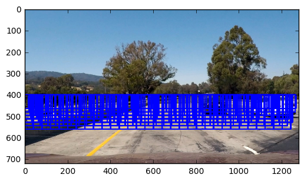
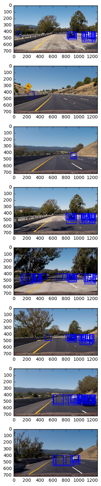
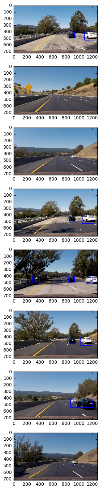

**Vehicle Detection Project**

The goals / steps of this project are the following:

* Perform a Histogram of Oriented Gradients (HOG) feature extraction on a labeled training set of images and train a classifier Linear SVM classifier
* Optionally, you can also apply a color transform and append binned color features, as well as histograms of color, to your HOG feature vector.
* Note: for those first two steps don't forget to normalize your features and randomize a selection for training and testing.
* Implement a sliding-window technique and use your trained classifier to search for vehicles in images.
* Run your pipeline on a video stream (start with the test_video.mp4 and later implement on full project_video.mp4) and create a heat map of recurring detections frame by frame to reject outliers and follow detected vehicles.
* Estimate a bounding box for vehicles detected.


## Project Structure
1. model_parameters.py

  In order to allow parameters be shared between notebooks, the parameters used for training and detection are listed in there.

1. lesson_functions.py

  The feature extraction logic and detection logic of the project is listed in there. Python notebooks for detection only responses for reading the inputs and print the outputs. Python notebook for training will do the training on his way.

1. Classifier.ipynb

  The training happens here

1. Vehicle_Detection_(image).ipynb

  Detect cars in test images

1. Vehicle_Detection_(video).ipynb

  Detect cars in project video, and output the result to `test_video_output.mp4`

##  [Rubric](https://review.udacity.com/#!/rubrics/513/view) Points
### Here I will consider the rubric points individually and describe how I addressed each point in my implementation.  

---
### Writeup / README

#### 1. Provide a Writeup / README that includes all the rubric points and how you addressed each one.  You can submit your writeup as markdown or pdf.  [Here](https://github.com/udacity/CarND-Vehicle-Detection/blob/master/writeup_template.md) is a template writeup for this project you can use as a guide and a starting point.  

You're reading it!

### Histogram of Oriented Gradients (HOG)

#### 1. Explain how (and identify where in your code) you extracted HOG features from the training images.

I perform the training in the IPython notebook called `Classifier.ipynb`. The training parameters are listed in another python file named `model_parameters.py`, because we do need these parameters when we process the video. It would be better for us to put these parameters into a standalone file.

In `Classifier.ipynb`, I started by reading in all the `vehicle` and `non-vehicle` images.

Here are example of vehicle sample and non-vehicle sample:

##### vehicle
  

##### non vehicle
  

Then I train the model with provided in the course note, and see how the model works on the test images given. If I feel the model is not working good on the test images, then I adjust the parameter, do the training and testing again.

Here is the parameter I started with
```
color_space = 'RGB' # Can be RGB, HSV, LUV, HLS, YUV, YCrCb
orient = 9  # HOG orientations
pix_per_cell = 8 # HOG pixels per cell
cell_per_block = 2 # HOG cells per block
hog_channel = 'ALL' # Can be 0, 1, 2, or "ALL"
spatial_size = (16, 16) # Spatial binning dimensions
hist_bins = 16    # Number of histogram bins
spatial_feat = True # Spatial features on or off
hist_feat = True # Histogram features on or off
hog_feat = True # HOG features on or off
y_start_stop = [None, None] # Min and max in y to search in slide_window()
```

I implemented the hog feature extraction in `get_hog_features`. The function forwards hog parameters to the `hog` function provided by `skimage.feature`.

#### 2. Explain how you settled on your final choice of HOG parameters.

During the trial and errors, I found that that performing hog feature extraction in YCrCb color space results in betters matching, so I do the extracting in YCrCb color space.

After choosing color space, then I start picking channels. Although the course material is using all channel on training, however, I found that the 3rd channel is performing poor, and using only 1st channel is enough to train a good model, so I use only the 1st channel in my training.

I get the final value of parameter by trials and errors, so there is no visualization of hog features created, and this is my final choice of hog parameters:

```
hog_color_space = 'YCrCb' # Can be RGB, HSV, LUV, HLS, YUV, YCrCb
orient = 9  # HOG orientations
pix_per_cell = 8 # HOG pixels per cell
cell_per_block = 2 # HOG cells per block
hog_channel = 0 # Can be 0, 1, 2, or "ALL"
```

#### 3. Describe how (and identify where in your code) you trained a classifier using your selected HOG features (and color features if you used them).

Although the model trained with hog feature has good accuracy, > 97%, however, involving color features in training will result in a model with even higher accuracy, > 98%. So I have included color features in my training. There are two types of color features, color histogram features and binned color features. I included both of them in my training. I adjust the parameters of these features by trials and errors, again.

These are the color feature parameters I choose:
```
spatial_color_space = 'LUV' # Can be RGB, HSV, LUV, HLS, YUV, YCrCb
spatial_size = (32, 32) # Spatial binning dimensions

hist_color_space = 'LUV' # Can be RGB, HSV, LUV, HLS, YUV, YCrCb
hist_bins = 32    # Number of histogram bins
```

I concatenated these features into a feature array, then I normalize the value of the features, to avoid any single feature overweights another.

Now we had all features that can be used to train the model.

I used LinearSVM to train my classifier. I used all default training parameters because the classifier trained with these default values looks good to me.

The training is done in `Classifier.ipynb` notebook. We extract the features by `get_hog_features`, `bin_spatial` and `color_hist` functions. All these feature extracted will be concatenated in `extract_features`. Classifier notebook read concatenated features and train the model with `LinearSVC`.

The output model is saved in `classifier.pkl`.

### Sliding Window Search

#### 1. Describe how (and identify where in your code) you implemented a sliding window search.  How did you decide what scales to search and how much to overlap windows?

Our goal is finding cars in a given video frame, and we don't know where the cars are in the frame. So we have to perform sliding window search to finding cars in the frame.

The windows I used are in 7 different sizes. Because the size of cars depends on it's position. If the car is far away, then the car looks small in the image, and we need to use a smaller window for finding them; else if the car is close to us, then we have to use a larger window.

Because the cars will not be in the sky, so I do only perform searching from the middle to the end of the frame. On the other hand, I do not perform any sliding on y axis, because the position of cars are related to it's size as I mentioned before, there should be no two cars with similar size but in difference level of y.

Here is the visualized windows I searched, and the parameter I use to generate them
  
```
window = 64
pix_per_cell = 8 # HOG pixels per cell
nxblocks = (image.shape[1] // pix_per_cell)-1
nblocks_per_window = (window // pix_per_cell)-1
cells_per_step = 2  # Instead of overlap, define how many cells to step
nxsteps = (nxblocks - nblocks_per_window) // cells_per_step
nysteps = 1
```

The sliding window search is done in `find_cars` function. The function is based on the one provided in classroom, and I modified it, such that I can adjust the color spaces of each features, and disable features
that are not in used.

#### 2. Show some examples of test images to demonstrate how your pipeline is working.  What did you do to optimize the performance of your classifier?

Here is the result of sliding windows search
  

After we perform detection on each windows, we may get lots of windows of positive results. All positive results might be a car, may not be a car. If the area contains a car, then the area should be marked positive by multiple windows. If the area is highlighted by multiple windows, then we can say that the area is a car confidently. As a result I applied a threshold 5 on heat map to get the area highlighted by multiple windows on my pipeline

Here is the result of my pipeline on the test images. As you can see, it fails on some test images. It misses the car in the third test image. I think this error is acceptable. Perhaps my pipeline has some problem on this particular frame, however, we have previous frames can be used while we are processing. We may adjust the result of current frame with that of previous frame. If the car is detected on previous frame, then we may tell the pipeline that there is a car on that position.

  

hog feature extraction is slow, if we do hog feature extraction from 0 in each searching, then the time needed will be huge. In order to solve this problem. I extract hog features from the frame once, then I calculate the hog features of each window from this big features. As a result, I do only need to calculate the hog feature from image once.


---

### Video Implementation

#### 1. Provide a link to your final video output.  Your pipeline should perform reasonably well on the entire project video (somewhat wobbly or unstable bounding boxes are ok as long as you are identifying the vehicles most of the time with minimal false positives.)
Here's a [link to my video result](https://youtu.be/eXGBcekHO7g)


#### 2. Describe how (and identify where in your code) you implemented some kind of filter for false positives and some method for combining overlapping bounding boxes.

I recorded the positions of positive detections in each frame of the video. For any of given frame, i , I did not only use the positive detection of that frame to find car, and also add the positive detections from at most 4 frames before that to the i-th frame. Then I made the heat map from these positive detections, and filter the result with threshold 5 times number of frame I used to generate the map.

I do so because I believe there may be false positive detections or false negative detections in any given frame. However, these false detections in frame i might not exist in the frames before frame i, and the cars should be in the similar position in continuous frames. So combining the detection from continuous frames might help a better results.

I implemented the averaging in `get_image_with_car_highlighted` function. All the positive detections from frame were added to a list named `matched_windows_stack`. The size of list is limited to `max_stack_size = 5`. The list should contains positive dection from most recent 5 frame, including the frame we are going to perform detection. When I generate the heat map, I read all positive detections from the list, and apply threshold `5*len(matched_windows_stack)`. The outcome should be the cars found in current frame.

---

### Discussion

#### 1. Briefly discuss any problems / issues you faced in your implementation of this project.  Where will your pipeline likely fail?  What could you do to make it more robust?

There are still false detections in the project video.

There are two false positive detection in the first frame of the video. Seems that there is no previous frames can be used to adjust the result, so the false position in that frame cannot be eliminated by averaging result from series of frames. Seems that the only way to solve this problem is that making a more robust algorithm to detect cars in given window.

There are false negative detection in ~23s of the video. The car is not detected in that frames, however, the car can be detected in the second before that. Seems that we can solve this problem by increasing the number of previous frames used in averaging. If we involve the frames in second before it, then we may be about the override the false negative detection in current frame with true position detections from previous frame. However, My notebook took almost an hour to generate the output video, and I am not able to do the video processing now.

Because my notebook took almost an hour to process a video ~26s. Which means I spent ~2 minutes to process 1s of video. In reality, this processing time is not acceptable. The car needs immediate response, and 2 minutes is too long. In order to solve this issue, perhaps I should try using CNN to detect car. Perhaps we can get detection from CNN immediately.
